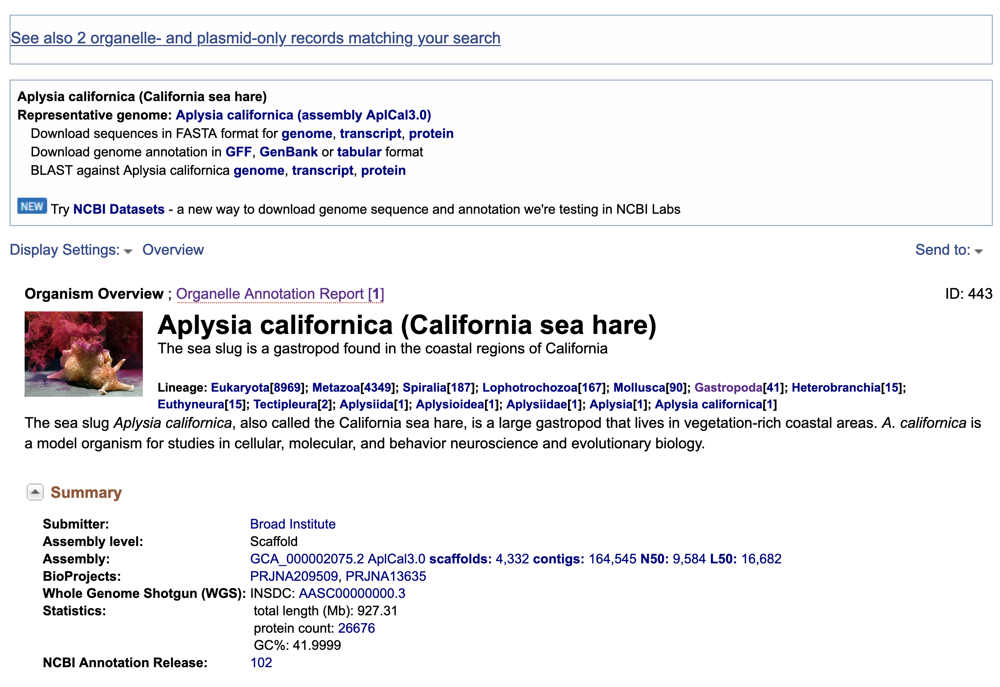

Genome skimming exercise (last updated 2021.03.02)
===================================================

This page is part of the `Ecology Master Class <http://tigp-biodiv.biodiv.tw/index.php/emt-tigp-signature-course/>`_. We will take the sequences that we sampled and produced from MinION platform and see if we can retrieve the mitochondrial genome!

Relevant reading:
1.
2.
3.

==========================================
Step 1: Which species to choose/download?
==========================================

Most of the complete mitochondrial genomes are available in the `Organelle Genome Resources <https://www.ncbi.nlm.nih.gov/genome/organelle/>`_ . So try to search for the complete mitogenome of most closely related species of your Sample.

Since we previously identified our sample as Aplysia xxxx, just type aplysia and click search. You should see the search result something like this.

Image here. 

You should immediately found that representative organism in the group is the California sea hare Aplysia californica. And there's a `Organelle Annotation Report 1 <https://www.ncbi.nlm.nih.gov/genome/browse/#!/organelles/443/>`_ . Don't be afraid and click into it. You should then find the summary of the mitogenome and its accession number `NC_005827.1 <https://www.ncbi.nlm.nih.gov/nuccore/NC_005827.1>`_ . Click!

Please download the coding sequences in the fasta protein format (See screenshot).

===========================================
Step 2: Upload the sequences to the server
===========================================

Once the file is available, you will need to copy the sequence to the server, where the raw sequences and programs reside. The server's address will be made available on the day of the class.

.. code-block:: console
	:linenos:

	# scp: Secure Copy (from the SSH suite of computer applications 
	# for secure communication)
	scp source_file_name destination_file_name

	# Example 1
	# From laptop/desktop to Server
	# Need to open a terminal and go to the directory to where the sequence is
	# usually @ ~/Downloads
	scp sequence.txt tigpsign2021@xxxxxxxxx:/home/tigpsign2021/Aoc/pep.fa

	# Example 2
	# copy from server to laptop/desktop
	scp tigpsign2021@xxxxxxxxxx:/home/tigpsign2021/file_name ~/Desktop/filename

	# Now please try to upload the protein fasta sequence to server

===========================================
Understand your sequence data
===========================================

In the home directory, you will see a few fastq files that contains raw sequences of the samples that you have sequenced.

.. code-block:: console
	:linenos:

	# home directory is /home/tigpsign2021/

	# First do a pwd
	# pwd = print working directory
	# You should see that you are in /home/tigpsign2021/
	pwd

	# now we want to make a directory
	mkdir Aoc

	# Try ls (abbreviation for list)
	# You should see a list of fastq file and the folder Aoc which you just created
	ls

	# ls or any Linux commands can be added with different arguments
	ls -lrt

	# cd to directory
	cd Aoc
	pwd

	# you want to copy fastq file into the new working folder and renamed to data.fastq.gz
	# ../ means previous directory
	cp ../Aoc.fastq.gz data.fastq.gz

	# data stats
	fastn2stats.py --fastn data.fastq.gz

	# Search for closely related species  
	# See [Step 1]

	# Copy the protein sequences from your desktop to your current working directory in the server using # And rename it to pep.fa
	# Remember you can do it in one step!
	# See [Step 2]

===========================================
Search for putative mitogenome sequences
===========================================

.. code-block:: console
	:linenos:

	# Come back to original directory
	# diamond makedb
	diamond makedb --threads 8 --in pep.fa -d ref

	db=ref

	# match reference
	diamond blastx -b5 -c1 --threads 8 -d $db -q data.fastq.gz -o $db.matches.tsv

	# get the ID out
	awk '{print $1}' $db.matches.tsv | sort | uniq > $db.match.id

	# get the reads out
	fastq_subset.firstfield.pl $db.match.id  data.fastq.gz

	# stats
	fastn2stats.py --fastn data.fastq.gz.subseq.fq

===========================================
Assembly
===========================================

.. code-block:: console
	:linenos:

	# flye
	# flye if not working set --min-overlap 1000 or 1500
	# if longer sequence than expected and failed to circlise then set --min-overlap 3000
	flye --nano-raw data.fastq.gz.subseq.fq --out-dir out_nano --threads 8 --min-overlap 3000

===========================================
Annotation using MITOS online
===========================================

.. code-block:: console
	:linenos:
	# 1. Plase copy to your working directory using cp
	cp /mnt/nas1/hhl/signature/TIGPsignaturecourse.2/BRCnpN345_Aoc/out_nano/medaka/consensus.fasta Aoc.mito.fasta

	# 2. try a few command. For example. How long is it?
	# See previous command or use seqstat

	# 3. Copy the sequence to your desktop/laptop using scp and try to blast to NCBI. What to you find?

	# 4. Annotate using MITOS 
	http://mitos.bioinf.uni-leipzig.de/index.py

==============================================
Alternative mitogenome annotation using MitoZ
==============================================

.. code-block:: console
	:linenos:

	# 5. Annotation using mitoZ; Result here:
	# Copy the files from this to your working directory OR your desktop/laptop
	# Have a browse
	/mnt/nas1/hhl/signature/TIGPsignaturecourse.2/BRCnpN345_Aoc/out_nano/mitoZ.result/

===========================================
Reference of the programs used
===========================================

1. The `flye <https://github.com/fenderglass/Flye>`_ assembler 
#. `DIAMOND <https://github.com/bbuchfink/diamond>`_ which is a sequence aligner for protein and translated DNA searches, which is MUCH faster than BLAST
#. `MITOS WebServer <http://mitos.bioinf.uni-leipzig.de/index.py>`_ which annotates mitogenomes online
#. `mitoZ <https://github.com/linzhi2013/MitoZ>`_ which is a local tool for annotating mitogenomes (can be quite hard to install to run).

.. note:: Email ijtsai at sinica.edu.tw if you have any problems/suggestions about the genome skimming exercise
