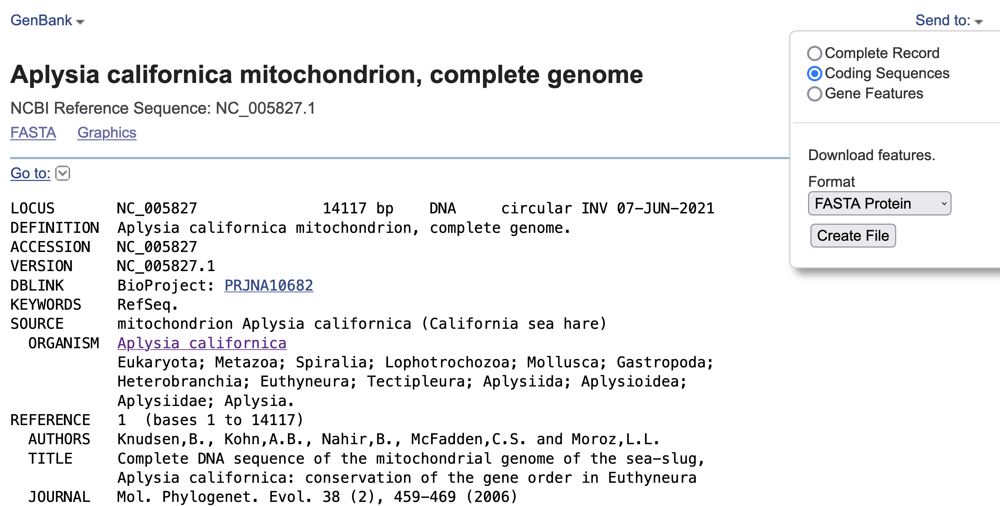

Genome skimming exercise (last updated 2022.04.14)
===================================================

This page is part of the `Ecology Master Class <http://tigp-biodiv.biodiv.tw/index.php/emt-tigp-signature-course/>`_. We will take the sequences that we sampled and produced from MinION platform and see if we can retrieve the mitochondrial genome!

Relevant reading:
1. `Genome skimming for next-generation biodiversity analysis <https://doi.org/10.1016/j.tplants.2015.06.012>`_

2. `Utilisation of Oxford Nanopore sequencing to generate six complete gastropod mitochondrial genomes as part of a biodiversity curriculum <https://www.biorxiv.org/content/10.1101/2022.03.24.485721v1>`_

==========================================
Step 1: Which species to choose/download?
==========================================

Most of the complete mitochondrial genomes are available in the `Organelle Genome Resources <https://www.ncbi.nlm.nih.gov/genome/organelle/>`_ . So try to search for the complete mitogenome of most closely related species of your Sample.

Since we previously identified our sample as Aplysia xxxx, just type aplysia and click search. You should see the search result something like this.

.. image:: images/AplysiaSearchRes.png
  :width: 800
  :alt: Search result

You should immediately found that representative organism in the group is the California sea hare Aplysia californica. And there's a `Organelle Annotation Report 1 <https://www.ncbi.nlm.nih.gov/genome/browse/#!/organelles/443/>`_ . Don't be afraid and click into it. You should then find the summary of the mitogenome and its accession number `NC_005827.1 <https://www.ncbi.nlm.nih.gov/nuccore/NC_005827.1>`_ . Click!

Please download the coding sequences in the fasta protein format (See screenshot). This will act as the bait sequence to identify putative mitochondrial sequences from our sample.

===========================================
Step 2: Upload the sequences to the server
===========================================

Once the sequence file is available, you will need to copy the sequence to the server, where the raw sequences and programs reside. The server's address will be made available on the day of the class.

.. code-block:: console
	:linenos:

	# scp: Secure Copy (from the SSH suite of computer applications 
	# for secure communication)
	scp source_file_name destination_file_name

	# Example 1
	# From laptop/desktop to Server
	# Need to open a terminal and go to the directory to where the sequence is
	# usually @ ~/Downloads
	# Need to replace groupx with your group number (e.g., group1, group2)
	scp sequence.txt tigp2022@xxxxxxxxx:/home/tigp2022/group1/pep.fa

	# Example 2
	# copy from server to laptop/desktop
	scp tigp2022@xxxxxxxxxx:/home/tigp2022/file_name ~/Desktop/filename

	# Now please try to upload the protein fasta sequence to server

===============================================================
Login to the server and start understanding your sequence data
===============================================================

In the home directory, you will see a few fastq files that contains raw sequences of the samples that you have sequenced.

.. code-block:: console
	:linenos:

	# home directory is /home/tigp2022/

	# First do a pwd
	# pwd = print working directory
	# You should see that you are in /home/tigp2022/
	pwd

	# Try ls (abbreviation for list)
	# You should see a list of fastq file and the folder Aoc which you just created
	ls

	# ls or any Linux commands can be added with different arguments
	# What files have we got here?
	ls -lrt

	# now we want to move around the folders. We use cd (Change Directory) command
	# change to the data directory
	# Inspect using ls
	# ../ means previous directory
	cd data
	pwd
	ls -lrt
	cd ../
	pwd

	# you can use cd ~/ to go back to your home directory (if you are lost)
	cd ~/

Now that you know how to move around, you can try to inspect some files

.. code-block:: console
	:linenos:

	# Go to the data folder again and find try to view a fastq file.
	# Since they are gzipped. You need to use the command zless
	zless Aoc.R1.fastq.gz

	# use space to go page down, use arrows to go up and down. 
	# use q to quit viewing the file

Let's start the analysis!

.. code-block:: console
	:linenos:

	# cd to your groups's directory. This will the directory you will carry out your analyses
	# cd means Change directory
	# We will use group1 as an example
	cd ~/group1
	pwd

	# you want to copy fastq file into the new working folder and renamed to data.fastq.gz
	# ../ means previous directory
	# . means current directory
	cp ../data/Aoc.R1.fastq.gz .
	cp ../data/Aoc.R2.fastq.gz .

	# Since we have two fastq files which correspond to sequencing output of individual
	# sequencing runs. We will combine them using cat (short for for conCATnate) command
	cat Aoc.R1.fastq.gz Aoc.R2.fastq.gz > data.fastq.gz

	# data stats
	# what does the output mean?
	fastn2stats.py --fastn Aoc.R1.fastq.gz
	fastn2stats.py --fastn Aoc.R2.fastq.gz
	fastn2stats.py --fastn data.fastq.gz

	# Search for closely related species  
	# See [Step 1]

	# Copy the protein sequences from your desktop to your current working directory in the server using # And rename it to pep.fa
	# Remember you can do it in one step!
	# See [Step 2]

===========================================
Search for putative mitogenome sequences
===========================================

.. code-block:: console
	:linenos:

	# Come back to original directory
	# diamond makedb
	diamond makedb --threads 8 --in pep.fa -d ref

	# match reference
	# what does the output say?
	diamond blastx -b5 -c1 --threads 8 -d ref -q data.fastq.gz -o ref.matches.tsv

	# get the ID out
	awk '{print $1}' ref.matches.tsv | sort | uniq > ref.match.id

	# get the reads out
	fastq_subset.firstfield.pl ref.match.id data.fastq.gz data.fastq.gz.subseq.fq

	# stats
	fastn2stats.py --fastn data.fastq.gz.subseq.fq

===========================================
Assembly
===========================================

.. code-block:: console
	:linenos:

	# flye
	# flye if not working set --min-overlap 1000 or 1500
	# if longer sequence than expected and failed to circlise then set --min-overlap 3000
	flye --nano-raw data.fastq.gz.subseq.fq --out-dir out_nano --threads 8 --min-overlap 3000

===========================================
Annotation using MITOS online
===========================================

.. code-block:: console
	:linenos:

	# 1. Go to the flye assembly folder and look around
	cd out_nano
	ls -lrt

	# 2. try a few command. For example. How long is it?
	# Any previous command you could use? or use the new seqstat command.
	fastn2stats.py --fastn assembly.fasta
	seqstat assembly.fasta

	# 3. Print the sequence onto screen. 
	cat assembly.fasta
	less assembly.fasta

	# 4. Copy the sequence to your desktop/laptop using scp and try to blast to NCBI. What to you find?
	
	# 5. Annotate using MITOS 
	http://mitos.bioinf.uni-leipzig.de/index.py

==============================================
Alternative mitogenome annotation using MitoZ
==============================================

.. code-block:: console
	:linenos:

	# 5. Annotation using mitoZ; Result here:
	# Copy the files from this to your working directory OR your desktop/laptop
	# Have a browse
	# You can copy the files to your desktop to take a look, too!
	cd /home/tigp2022/mitoZ.result/Aoc/

==============================================
Do you want to try other species?
==============================================

===========================================
Reference of the programs used
===========================================

1. The `flye <https://github.com/fenderglass/Flye>`_ assembler 
#. `DIAMOND <https://github.com/bbuchfink/diamond>`_ which is a sequence aligner for protein and translated DNA searches, which is MUCH faster than BLAST
#. `MITOS WebServer <http://mitos.bioinf.uni-leipzig.de/index.py>`_ which annotates mitogenomes online
#. `mitoZ <https://github.com/linzhi2013/MitoZ>`_ which is a local tool for annotating mitogenomes (can be quite hard to install to run).

.. note:: Email ijtsai at sinica.edu.tw if you have any problems/suggestions about the genome skimming exercise
